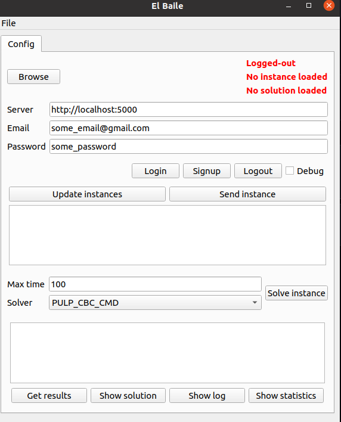

README
*****************

This README provides a description of all the examples in this repository.

All examples require a working and accessible installation of Cornflow server. For more information on how to install your own, visit: https://github.com/baobabsoluciones/corn

python-examples/gui/dance
==============================

Installation
---------------

In Windows, you need to replace the "source ..." line by: `venv/Scripts/activate`.

Steps::

    cd cornflow-examples/python-examples
    python3 -m venv venv
    source venv/bin/activate
    python3 -m pip install gui/dance/requirements.txt

Launch
---------------------

To open the app, just do the following::

    source venv/bin/activate
    python3 gui/dance/app.py

Connecting to server
---------------------

You need to provide a link to a cornflow server. Then, a username and a password.

If you don't have an account in the server, you will need to click on signup. Otherwise, click in login.

Creating a new instance
---------------------------

You need to click on "Browse" and select one of the example models under the "data" directory. The "No instance loaded" in red will change to "Instance loaded".

To send it to the server, you click the "Send instance" button.

Creating a new execution
-----------------------------

First, you need to have a loaded instance in the server. You select one from the list. Then, you configure the the "Max time" and "Solver" fields. Finally, you click the "Solve instance" button.

Inspecting instances
------------------------------------------

When you login, a list of instances appears in the first box. These instances are the previous instances loaded in the server for your user.

When clicking on an instance, you will see, in the box below, the list of the executions associated to that instance, if any.

If you right-click an instance, you can delete it, or update its status.

Inspecting executions
------------------------------------------

When selecting an execution, the options below can be used:

* "Get results" downloads the solution to the client.
* "Show solution" opens a new screen with the graph representation of the solution.
* "Show log" opens a new screen with a table representation of the solution process.

python-examples/cmd/line-balancing
======================================

Installation
---------------

Steps::

    cd cornflow-examples/python-examples
    python3 -m venv venv
    source venv/bin/activate
    python3 -m pip install cmd/line-balancing/requirements.txt

Launch
---------------------

To open the app, just do the following::

    source venv/bin/activate
    python3 cmd/line-balancing/main.py --help

How it works
---------------------

To run the help::

    python3 python/cmd/line-balancing/main.py --help

The app has currently three functions::

    Usage: main.py [OPTIONS] COMMAND [ARGS]...

    Options:
      --help  Show this message and exit.

    Commands:
      load-solution
      signup
      solve-problem

First, let's look at the signup command:

    python3 cmd/line-balancing/main.py signup --help
    Usage: main.py signup [OPTIONS]

    Options:
      --cornflow-url TEXT  URL to Cornflow server  [required]
      --email TEXT         Username  [required]
      --password TEXT      Password for the user.  [required]
      --name TEXT          Name of the user.  [required]
      --help               Show this message and exit.

This means we can create an account like so::

    python3 cmd/line-balancing/main.py signup --cornflow-url=http://localhost:5000 --email=pchtsp@gmail.com --password=pchtsp --name=franco
    Username pchtsp@gmail.com created correctly

Then, we let's look at the `solve-problem` command::

    python3 cmd/line-balancing/main.py solve-problem --help
    Usage: main.py solve-problem [OPTIONS]

    Options:
      --cornflow-url TEXT   URL to Cornflow server  [required]
      --email TEXT          Username  [required]
      --password TEXT       Password for the user.  [required]
      --data TEXT           Input data to solve the problem. See the default for
                            reference.

      --debug / --no-debug  If true prints details in console.
      --wait / --no-wait    If true waits for the solution to be ready.
      --help                Show this message and exit.

We can leave the data and wait as default for now and set `--no-debug`::

    python3 cmd/line-balancing/main.py solve-problem --cornflow-url=http://localhost:5000 --email=pchtsp@gmail.com --password=pchtsp --no-debug
    Status: Optimal
    Basic variables:
    CycleTime = 20.0
    TaskInStation_('task1',_'station1') = 1.0
    TaskInStation_('task10',_'station4') = 1.0
    TaskInStation_('task11',_'station4') = 1.0
    TaskInStation_('task12',_'station4') = 1.0
    TaskInStation_('task2',_'station2') = 1.0
    TaskInStation_('task3',_'station1') = 1.0
    TaskInStation_('task4',_'station3') = 1.0
    TaskInStation_('task5',_'station2') = 1.0
    TaskInStation_('task6',_'station2') = 1.0
    TaskInStation_('task7',_'station1') = 1.0
    TaskInStation_('task8',_'station3') = 1.0
    TaskInStation_('task9',_'station3') = 1.0
    Total Cost of Tasks =  20.0

This returns the solution as well as the optimal objective function. In fact: this function sends a default instance to the server and waits for it to solve it, then reads it back.

If we set `--no-wait`, the app will return an execution id code instead of waiting for it to solve::

    python3 cmd/line-balancing/main.py solve-problem --cornflow-url=http://localhost:5000 --email=pchtsp@gmail.com --password=pchtsp --no-debug --no-wait
    Instance id is: 2d0e02f44cfcbfcb7d9e250b73c4a9fa0478f88f
    Execution id is: 1af6129cabdaf2a95a0ee36c7ec1f255e9042617

We can now use the last function to get the results and show them::

    python3 cmd/line-balancing/main.py load-solution --cornflow-url=http://localhost:5000 --email=pchtsp@gmail.com --password=pchtsp --no-debug --execution-id=1af6129cabdaf2a95a0ee36c7ec1f255e9042617
    Status: Optimal
    Basic variables:
    CycleTime = 20.0
    TaskInStation_('task1',_'station1') = 1.0
    TaskInStation_('task10',_'station4') = 1.0
    TaskInStation_('task11',_'station4') = 1.0
    TaskInStation_('task12',_'station4') = 1.0
    TaskInStation_('task2',_'station2') = 1.0
    TaskInStation_('task3',_'station1') = 1.0
    TaskInStation_('task4',_'station3') = 1.0
    TaskInStation_('task5',_'station2') = 1.0
    TaskInStation_('task6',_'station2') = 1.0
    TaskInStation_('task7',_'station1') = 1.0
    TaskInStation_('task8',_'station3') = 1.0
    TaskInStation_('task9',_'station3') = 1.0
    Total Cost of Tasks =  20.0

